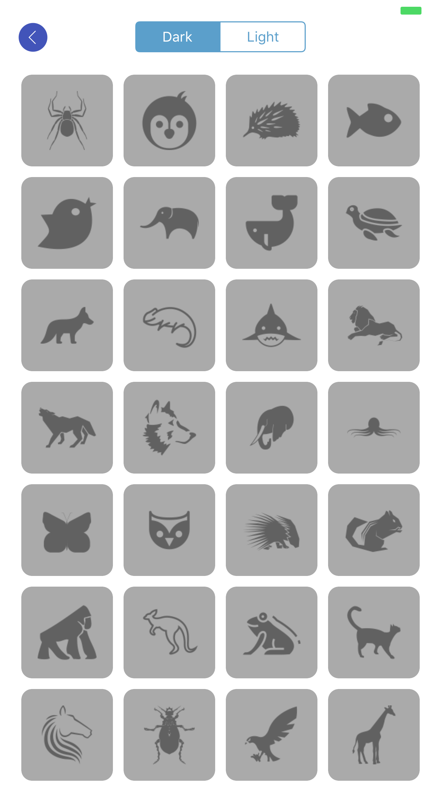

# DevSlopesProj-Confaby
iOS Slack clone that features realtime chat messaging

Made for the iOS 11 development course from DevSlopes. Basically renamed from their chat demo app "Smack". The name "Confaby" comes from the word "confab", which itself comes from "confabulate", which means "to talk informally or to hold a discussion".

The backend code was completely written by DevSlopes developers, and a copy of it is running on Heroku at https://confaby.herokuapp.com/ .

The project requires certain Cocoapod libraries, see the Podfile for more information.

